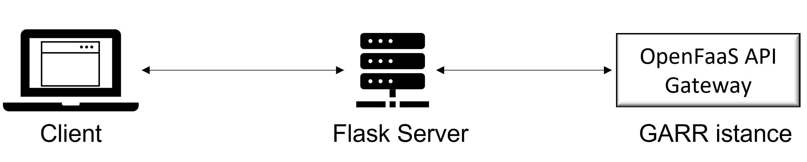

<div id="top">
  
<div align="center">
  <a href="https://wfxr.mit-license.org/2017">
        
    </a>
    <a href="https://www.python.org/downloads/release/python-380/">
        
    </a>
      <a href="https://www.openfaas.com">
        
    </a>
      <a href="https://www.openfaas.com">
        
    </a>
          <a href="https://docs.docker.com/">
        
    </a>
        <a href="https://https://flask.palletsprojects.com/en/2.1.x/">
        
    </a>
        <a href="https://kubernetes.io/">
        
    </a>
    <a href="https://github.com/BananaCloud-CC2022-Parthenope/BananaCloud">
        
    </a>
  </div>
</div>
<!-- PROJECT LOGO -->
<br />
<div align="center">
  <a href="https://github.com/BananaCloud-CC2022-Parthenope/BananaCloud">
    
  </a>

<h3 align="center">Banana Cloud</h3>

  <p align="center">
    This repository is about our project, deploying a Deep Learning Model for the classification of ripeness state of bananas
    as a Function-as-a-Service using OpenFaas. Keep reading to find out how to do it. 
    <br />
    <a href="https://github.com/BananaCloud-CC2022-Parthenope/BananaCloud"><strong>Explore the docs »</strong></a>
    <br />
    <br />
    ·
    <a href="https://github.com/BananaCloud-CC2022-Parthenope/BananaCloud/issues">Report Bug</a>
    ·
    <a href="https://github.com/BananaCloud-CC2022-Parthenope/BananaCloud/issues">Request Feature</a>
  </p>
</div>


<!-- TABLE OF CONTENTS -->
<details>
  <summary>Table of Contents</summary>
  <ol>
    <li>
      <a href="#about-the-project">About The Project</a>
      <ul>
        <li><a href="#built-with">Built With</a></li>
      </ul>
    </li>
    <li>
      <a href="#getting-started">Getting Started</a>
      <ul>
        <li><a href="#prerequisites">Prerequisites</a></li>
        <li><a href="#creation-and-configuration-of-the-function">Creation and Configuration of the function</a></li>
      </ul>
    </li>
    <li><a href="#metrics">Metrics</a></li>
    <li><a href="#autoscaling">Autoscaling</a></li>
    <li><a href="#web-app">Web App</a></li>
    <li><a href="#contributing">Contributing</a></li>
    <li><a href="#license">License</a></li>
    <li><a href="#contacts">Contacts</a></li>
    <li><a href="#acknowledgments">Acknowledgments</a></li>
  </ol>
</details>


<!-- ABOUT THE PROJECT -->
## About The Project

In this work we took a pre-trained Convolutional Neural Network model that classifies the ripeness state of bananas and we made it serverless as a Function-as-a-Service using OpenFaas. In doing so we gained some advantages: the images to classify aren't saved locally on disk, but only kept in memory as we have defined the function handler that only takes images in a HTTP request.

We deployed our function on a Cloud machine provided by the italian "Gestione Ampliamento Rete Ricerca" (GARR) institute, and to invoke it we set up a small Flask webApp, in which clients make a request to the service by sending images through a browser, after which the webserver will forward the request to the instance on the GARR, as shown in the following figure: 
<div align="center">
    
</div>


To learn more about the project see the [Project Report](BananaCloud_Report.pdf)

An example of use:
<div align="center">
    
 </div>


<p align="right">(<a href="#top">back to top</a>)</p>


### Built With

* [OpenFaas](https://www.openfaas.com/)
* [k3sup](https://github.com/alexellis/k3sup)
* [Kubernetes](https://kubernetes.io/)
* [Docker](https://www.docker.com/)
* [Grafana](https://grafana.com/)
* [YOLOV5](https://github.com/ultralytics/yolov5)
* [Pytorch](https://pytorch.org/)

<p align="right">(<a href="#top">back to top</a>)</p>


<!-- GETTING STARTED -->
## Getting Started

Before starting, keep in mind that the model provided hasn't the weigths files, so if you want to use our model, you have to train it from scratch.

To make the project work not locally you have to provide the [WebApp](WebApp/server.py) the url where the serverless function is running and waiting for HTTP requests.


### Prerequisites

* Install [Docker](https://docs.docker.com/engine/install/ubuntu/)
* Install [kubectl](https://kubernetes.io/docs/tasks/tools/install-kubectl-linux/)
* Install [k3sup](https://github.com/alexellis/k3sup) ver. 0.11.3
* Install the [faas-cli](https://docs.openfaas.com/cli/install/)
* Use [arkade](https://github.com/alexellis/arkade) to install all the above
* Set this environment variable, we'll need it for the next commands
  ```sh
   export IP="YOUR CLOUD MACHINE'S PUBLIC IP"
   ```
* using k3sup install k3s on the cluster, using the IP we've set before
  ```sh
   k3sup install --ip $IP --user ubuntu --ssh-key $HOME/key.pem
   ```
Note that the username is the one on our machine, and the key.pem file is the key to access our cluster via ssh. Use the one you need.

* Check if all went well using the following commands
  ```sh
  export KUBECONFIG=/home/<username>/kubeconfig
  kubectl config set-context linode-openfaas
  kubectl get nodes -o wide
   ```
* Install OpenFaas using arkade
  ```sh
  arkade install openfaas
   ```
* Check if openfaas was successfully installed
  ```sh
  kubectl get deploy --namespace openfaas
   ```
* Forward all requests made to http://localhost:8080 to the pod running the gateway service.
  ```sh
  kubectl port-forward -n openfaas svc/gateway 8080:8080 &
   ```
<p align="right">(<a href="#top">back to top</a>)</p>

### Creation and Configuration of the function

* Clone the repository
  ```sh
   git clone https://github.com/BananaCloud-CC2022-Parthenope/BananaCloud.git
   ```
* Move to the OpenFaaS_function folder
* Edit the banana-cloud.yml updating the "<docker_account>" line in the image field with your DockerHub username
* Build the function
  ```sh
    faas-cli build -f banana-cloud.yml
   ```
* Login to your docker account in the shell
* Push the builded image to DockerHub
  ```sh
    faas-cli push -f banana-cloud.yml
   ```
* Deploy the DockerHub image to the cluster
  ```sh
   faas-cli deploy -f banana-cloud.yml
   ```
* To make the function accessible 
  ```sh
   export OPENFAAS_URL=http://CLOUD_MACHINE_IP:PORT
   ```
Now the function is running and you can send the image you want to classify via an HTTP request to http://YOUR_CLUSTER_IP:PORT/function/banana-cloud 


<p align="right">(<a href="#top">back to top</a>)</p>


## Metrics

To check the state of the function we to monitor some metrics using Prometheus and Grafana.

* Expose the OpenFaas service Prometheus
  ```sh
   kubectl expose deployment prometheus -n openfaas --type=NodePort --name=prometheus-ui
   ```
* Forward all the requests made to http://localhost:9090 to the pod running the prometheus-ui service:
  ```sh
  kubectl port-forward -n openfaas svc/prometheus-ui 9090:9090 &
   ```
* To execute Grafana, install this image
  ```sh
  kubectl run grafana -n openfaas --image=stefanprodan/faas-grafana:4.6.3 --port=3000
   ```
* Expose Grafana Pod, making it an active service
  ```sh
  kubectl expose pods grafana -n openfaas --type=NodePort --name=grafana
   ```
* Forward all the requests made to http://localhost:3000 to the pod running the grafana service:
  ```sh
  kubectl port-forward -n openfaas svc/grafana 3000:3000 &
   ```
* Go to the Grafana dashboard visiting http://localhost:3000 usr/pswd are admin/admin and then Dashboard->Import

* In this page there is a text field "Grafana.com Dashboard" paste there this link https://grafana.com/grafana/dashboards/3434 to attach Grafana to the Prometheus metrics

* After clicking Loading, in the "faas" field of the next window use the "faas" attribute.

Now you should be monitoring all the metrics of the running function on the Cloud Machine.

<p align="right">(<a href="#top">back to top</a>)</p>

## Autoscaling

To enable scaling of the feature we used the Horizontal Pod Autoscaler from the Metric Server package of Kubernetes.

You can find the installation and configuration guide for this autoscaler [here](https://docs.openfaas.com/tutorials/kubernetes-hpa/)
Follows example of Grafana Dashboard with metrics and autoscaling.

<div align="center">
    
 </div>

<p align="right">(<a href="#top">back to top</a>)</p>


## Web App

To easily see the responses of the function, we made a simple Flask based web application. To run it go to the WebApp folder in another shell and, after installing [Flask](https://flask.palletsprojects.com/en/2.1.x/installation/) set the following environment variables.

* Set these environment variables
  ```sh
  export FLASK_APP=server
  export FLASK_ENV=deployment
   ```
   
* In the server.py file of the WebApp don't forget to place "http://CLOUD_MACHINE_IP:PORT/function/banana-cloud" in the url variable

* Run the flask app with
  ```sh
  flask run
   ```
* Now you should visit http://localhost:5000 in your browser to load bananas images and send requests to the function !

<p align="right">(<a href="#top">back to top</a>)</p>

<!-- CONTRIBUTING -->
## Contributing

Contributions are what make the open source community such an amazing place to learn, inspire, and create. Any contributions you make are **greatly appreciated**.

If you have a suggestion that would make this better, please fork the repo and create a pull request. You can also simply open an issue with the tag "enhancement".
Don't forget to give the project a star! Thanks again!

1. Fork the Project
2. Create your Feature Branch (`git checkout -b feature/AmazingFeature`)
3. Commit your Changes (`git commit -m 'Add some AmazingFeature'`)
4. Push to the Branch (`git push origin feature/AmazingFeature`)
5. Open a Pull Request

<p align="right">(<a href="#top">back to top</a>)</p>


<!-- LICENSE -->
## License

Distributed under the MIT License. See `LICENSE.txt` for more information.

<p align="right">(<a href="#top">back to top</a>)</p>

<!-- CONTACT -->
## Contacts

Antonio Di Marino - University of Naples Parthenope - [email](antonio.dimarino001@studenti.uniparthenope.it) - [LinkedIn](https://www.linkedin.com/in/antonio-di-marino/)

Vincenzo Bevilacqua - University of Naples Parthenope - [email](vincenzo.bevilacqua001@studenti.uniparthenope.it)

Michele Zito - University of Naples Parthenope - [email](michele.zito001@studenti.uniparthenope.it)

<p align="right">(<a href="#top">back to top</a>)</p>

<!-- ACKNOWLEDGMENTS -->
## Acknowledgments

* We thank the italian "Gestione Ampliamento Rete Ricerca" (GARR) institute for letting us use one of their Cloud machines as a cluster for this project - [Learn More](https://cloud.garr.it/)

<p align="right">(<a href="#top">back to top</a>)</p>


<!-- MARKDOWN LINKS & IMAGES -->
<!-- https://www.markdownguide.org/basic-syntax/#reference-style-links 
[contributors-shield]: https://img.shields.io/github/contributors/github_username/repo_name.svg?style=for-the-badge
[contributors-url]: https://github.com/github_username/repo_name/graphs/contributors
[forks-shield]: https://img.shields.io/github/forks/github_username/repo_name.svg?style=for-the-badge
[forks-url]: https://github.com/github_username/repo_name/network/members
[stars-shield]: https://img.shields.io/github/stars/github_username/repo_name.svg?style=for-the-badge
[stars-url]: https://github.com/github_username/repo_name/stargazers
[issues-shield]: https://img.shields.io/github/issues/github_username/repo_name.svg?style=for-the-badge
[issues-url]: https://github.com/github_username/repo_name/issues
[license-shield]: https://img.shields.io/github/license/github_username/repo_name.svg?style=for-the-badge
[license-url]: https://github.com/github_username/repo_name/blob/master/LICENSE.txt
[linkedin-shield]: https://img.shields.io/badge/-LinkedIn-black.svg?style=for-the-badge&logo=linkedin&colorB=555
[linkedin-url]: https://linkedin.com/in/linkedin_username
[product-screenshot]: images/screenshot.png
-->
