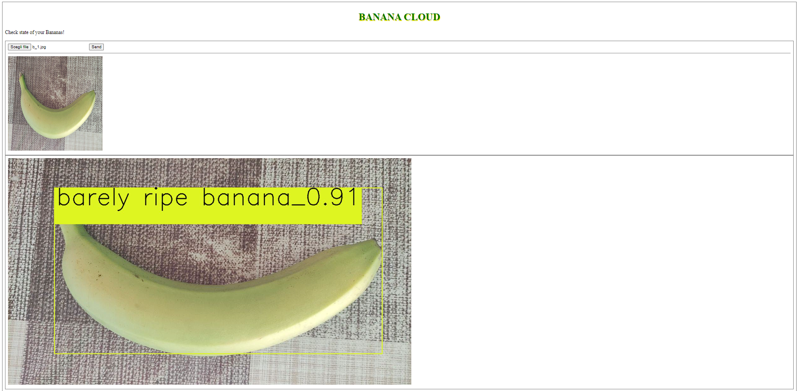

<div id="top"></div>

<!-- PROJECT LOGO -->
<br />
<div align="center">
  <a href="https://github.com/BananaCloud-CC2022-Parthenope/BananaCloud">
    
  </a>

<h3 align="center">Banana Cloud</h3>

  <p align="center">
    This repository is about our project, deploying a Deep Learning Model for the classification of ripeness state of bananas
    as a Function-as-a-Service using OpenFaas. Keep reading to find out how to do it. 
    <br />
    <a href="https://github.com/BananaCloud-CC2022-Parthenope/BananaCloud"><strong>Explore the docs »</strong></a>
    <br />
    <br />
    ·
    <a href="https://github.com/BananaCloud-CC2022-Parthenope/BananaCloud/issues">Report Bug</a>
    ·
    <a href="https://github.com/BananaCloud-CC2022-Parthenope/BananaCloud/issues">Request Feature</a>
  </p>
</div>


<!-- TABLE OF CONTENTS -->
<details>
  <summary>Table of Contents</summary>
  <ol>
    <li>
      <a href="#about-the-project">About The Project</a>
      <ul>
        <li><a href="#built-with">Built With</a></li>
      </ul>
    </li>
    <li>
      <a href="#getting-started">Getting Started</a>
      <ul>
        <li><a href="#prerequisites">Prerequisites</a></li>
        <li><a href="#installation">Installation</a></li>
      </ul>
    </li>
    <li><a href="#usage">Usage</a></li>
    <li><a href="#roadmap">Roadmap</a></li>
    <li><a href="#contributing">Contributing</a></li>
    <li><a href="#license">License</a></li>
    <li><a href="#contact">Contact</a></li>
    <li><a href="#acknowledgments">Acknowledgments</a></li>
  </ol>
</details>


<!-- ABOUT THE PROJECT -->
## About The Project

In this work we took a pre-trained Convolutional Neural Network model that classifies the ripeness state of bananas and we made it serverless as a Function-as-a-Service using OpenFaas. In doing so we gained some advantages: the images to classify aren't saved locally on disk, but only kept in memory as we have defined the function handler that only takes images in a HTTP request.

We deployed our function on a Cloud machine provided by the italian "Gestione Ampliamento Rete Ricerca" (GARR) institute. 

To learn more about the project see the [Project Report](BananaCloud_Report.pdf)

<div align="center">
    
 </div>


<p align="right">(<a href="#top">back to top</a>)</p>


### Built With

* [OpenFaas](https://www.openfaas.com/)
* [k3sup](https://github.com/alexellis/k3sup)
* [Kubernetes](https://kubernetes.io/)
* [Docker](https://www.docker.com/)
* [Grafana](https://grafana.com/)
* [YOLOV5](https://github.com/ultralytics/yolov5)
* [Pytorch](https://pytorch.org/)

<p align="right">(<a href="#top">back to top</a>)</p>


<!-- GETTING STARTED -->
## Getting Started

Before starting, keep in mind that the model provided hasn't the weigths files, so if you want to use our model, you have to train it from scratch.

To make the project work not locally you have to provide the [WebApp](WebApp/server.py) the url where the serverless function is running and waiting for HTTP requests.


### Prerequisites


This is an example of how to list things you need to use the software and how to install them.
* npm
  ```sh
  npm install npm@latest -g
  ```

### Installation

1. Get a free API Key at [https://example.com](https://example.com)
2. Clone the repo
   ```sh
   git clone https://github.com/github_username/repo_name.git
   ```
3. Install NPM packages
   ```sh
   npm install
   ```
4. Enter your API in `config.js`
   ```js
   const API_KEY = 'ENTER YOUR API';
   ```

<p align="right">(<a href="#top">back to top</a>)</p>


<!-- USAGE EXAMPLES -->
## Usage

Use this space to show useful examples of how a project can be used. Additional screenshots, code examples and demos work well in this space. You may also link to more resources.

_For more examples, please refer to the [Documentation](https://example.com)_

<p align="right">(<a href="#top">back to top</a>)</p>


<!-- ROADMAP -->
## Roadmap

- [ ] Feature 1
- [ ] Feature 2
- [ ] Feature 3
    - [ ] Nested Feature

See the [open issues](https://github.com/github_username/repo_name/issues) for a full list of proposed features (and known issues).

<p align="right">(<a href="#top">back to top</a>)</p>


<!-- CONTRIBUTING -->
## Contributing

Contributions are what make the open source community such an amazing place to learn, inspire, and create. Any contributions you make are **greatly appreciated**.

If you have a suggestion that would make this better, please fork the repo and create a pull request. You can also simply open an issue with the tag "enhancement".
Don't forget to give the project a star! Thanks again!

1. Fork the Project
2. Create your Feature Branch (`git checkout -b feature/AmazingFeature`)
3. Commit your Changes (`git commit -m 'Add some AmazingFeature'`)
4. Push to the Branch (`git push origin feature/AmazingFeature`)
5. Open a Pull Request

<p align="right">(<a href="#top">back to top</a>)</p>


<!-- LICENSE -->
## License

Distributed under the MIT License. See `LICENSE.txt` for more information.

<p align="right">(<a href="#top">back to top</a>)</p>


<!-- CONTACT -->
## Contacts

Antonio Di Marino - University of Naples Parthenope - [email](antonio.dimarino001@studenti.uniparthenope.it) - [LinkedIn](https://www.linkedin.com/in/antonio-di-marino/)

Vincenzo Bevilacqua - University of Naples Parthenope - [email](vincenzo.bevilacqua001@studenti.uniparthenope.it)

MicheleZito - University of Naples Parthenope - [email](michele.zito001@studenti.uniparthenope.it)

<!-- ACKNOWLEDGMENTS -->
## Acknowledgments

* We thank the italian "Gestione Ampliamento Rete Ricerca" (GARR) institute for letting us use one of their Cloud machines as a cluster for this project - [Learn More](https://cloud.garr.it/)

<p align="right">(<a href="#top">back to top</a>)</p>


<!-- MARKDOWN LINKS & IMAGES -->
<!-- https://www.markdownguide.org/basic-syntax/#reference-style-links 
[contributors-shield]: https://img.shields.io/github/contributors/github_username/repo_name.svg?style=for-the-badge
[contributors-url]: https://github.com/github_username/repo_name/graphs/contributors
[forks-shield]: https://img.shields.io/github/forks/github_username/repo_name.svg?style=for-the-badge
[forks-url]: https://github.com/github_username/repo_name/network/members
[stars-shield]: https://img.shields.io/github/stars/github_username/repo_name.svg?style=for-the-badge
[stars-url]: https://github.com/github_username/repo_name/stargazers
[issues-shield]: https://img.shields.io/github/issues/github_username/repo_name.svg?style=for-the-badge
[issues-url]: https://github.com/github_username/repo_name/issues
[license-shield]: https://img.shields.io/github/license/github_username/repo_name.svg?style=for-the-badge
[license-url]: https://github.com/github_username/repo_name/blob/master/LICENSE.txt
[linkedin-shield]: https://img.shields.io/badge/-LinkedIn-black.svg?style=for-the-badge&logo=linkedin&colorB=555
[linkedin-url]: https://linkedin.com/in/linkedin_username
[product-screenshot]: images/screenshot.png
-->
